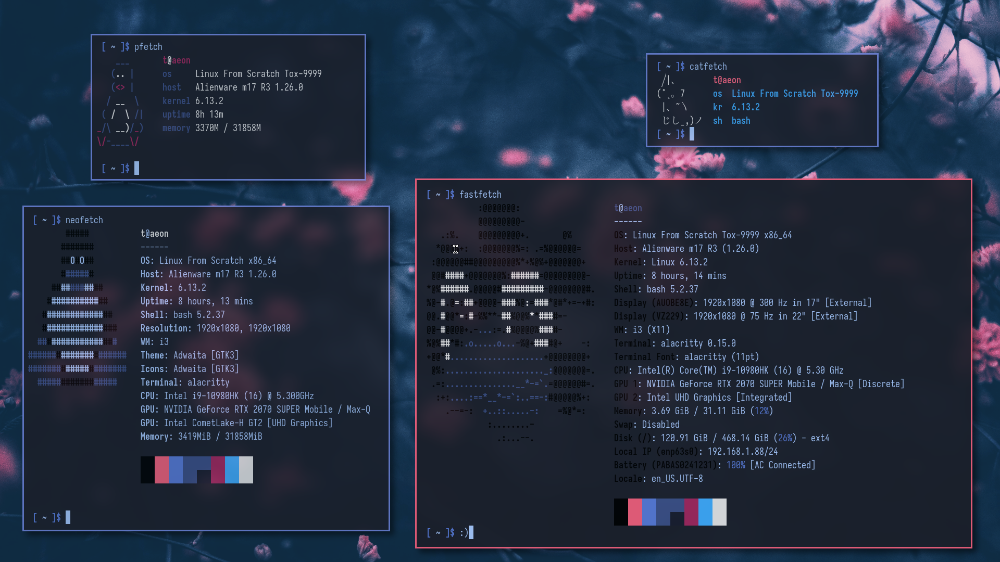

# Adding Sets

## Abstract
This page covers how to add your own sets.

### Why Bother?
Writing your own sets lets you quickly install and keep up-to-date packages
that you care about. For instance, if you have a collection of packages that
you just can't live without -- let's say, neofetch, fastfetch, pfetch, and
catfetch -- you can write a set to store them all.

### Writing That Set
First, let's see what we're working with.
```
 $ cd /var/ports/main/.sets
 $ ls
 @lfs
```

Since the lfs set doesn't have what we want (and it has a bunch of useless
bloat like man-pages and glibc), let's write our own set. How about we call it
'essentials'.
```
 # cat << EOF > @essentials
 > neofetch
 > pfetch
 > fastfetch
 > tox/catfetch
 > EOF
```

***Note:** The above commands assume you have the 'tox' repo added. If you
would like access to catfetch (you would like access to catfetch), read
[Chapter 2.4.2](../repos/adding.md) to learn how to add repos.*

### Installing The Set
Let's install @essentials, since I haven't posted a screenshot to r/unixporn in
almost half an hour.
```
 $ 2 -qi @essentials
󰗠  neofetch=7.1.0.tar.gz            [00:00:00] [================================================================] 93.16 KiB/93.16 KiB
󰗠  pfetch=0.6.0.tar.gz              [00:00:00] [================================================================] 17.02 KiB/17.02 KiB
󰗠  fastfetch=2.36.1.tar.gz          [00:00:00] [================================================================] 1.12 MiB/1.12 MiB
󰗠  catfetch=1.0.1.tar.gz            [00:00:00] [================================================================] 13.31 KiB/13.31 KiB
󱠇  Building 'neofetch=7.1.0'...
󰐗  Installing 'neofetch=7.1.0'...
󰗠  Built and installed 'neofetch=7.1.0' in 144.465 ms
󱠇  Building 'pfetch=0.6.0'...
󰐗  Installing 'pfetch=0.6.0'...
󰗠  Built and installed 'pfetch=0.6.0' in 75.390 ms
󱠇  Building 'fastfetch=2.36.1'...
󰐗  Installing 'fastfetch=2.36.1'...
󰗠  Built and installed 'fastfetch=2.36.1' in 13.015 s
󱠇  Building 'catfetch=1.0.1'...
󰐗  Installing 'catfetch=1.0.1'...
󰗠  Built and installed 'catfetch=1.0.1' in 617.573 ms
```

Now I can post this awesome screenshot!


